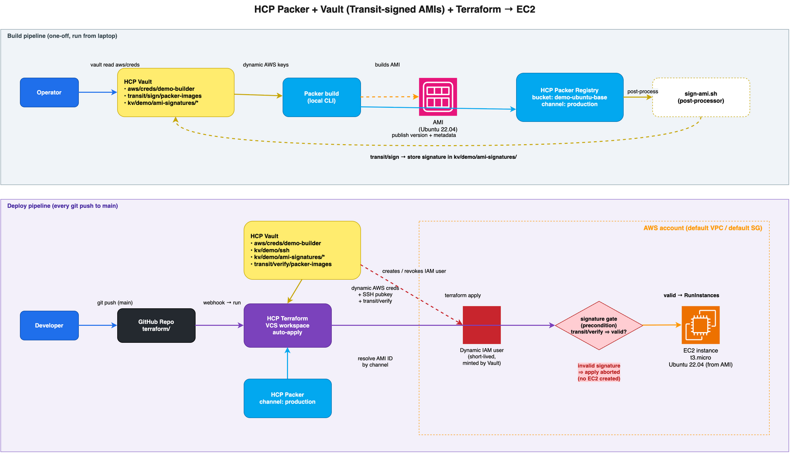

# Demo: HCP Packer + Vault + Terraform → EC2 (manual setup)

End-to-end HashiCorp stack demo. Everything is set up manually via web UIs and CLIs — no bootstrap scripts.



> Source: [assets/architecture.drawio](assets/architecture.drawio)

> **Security note:** never paste real tokens/keys into chat or shared docs. If a credential is exposed, rotate it immediately.

---

## What you'll have at the end

- An IAM user in your AWS sandbox account whose keys are stored in **HCP Vault** at `aws/config/root`.
- A Vault role `demo-builder` that mints **short-lived AWS IAM users** for Packer + Terraform.
- An ed25519 SSH keypair stored in Vault KV at `kv/demo/ssh`.
- A Vault **Transit** signing key at `transit/keys/packer-images` used to sign AMIs and verify them at deploy time.
- An **HCP Packer** bucket `demo-ubuntu-base` with a `production` channel.
- A **GitHub** repo containing the contents of [terraform/](terraform/).
- An **HCP Terraform** workspace VCS-connected to that repo, with auto-apply on push to `main`.

---

## Prerequisites

| Tool | Install |
|---|---|
| `terraform` ≥ 1.7 | https://developer.hashicorp.com/terraform/install |
| `packer` ≥ 1.10 | https://developer.hashicorp.com/packer/install |
| `vault` ≥ 1.16 | https://developer.hashicorp.com/vault/install |
| `aws` CLI | configured as admin on a sandbox account |
| `gh` CLI | `brew install gh && gh auth login` |
| `ssh-keygen`, `jq`, `git` | standard |

You also need accounts with: AWS, [HCP](https://portal.cloud.hashicorp.com), [HCP Terraform](https://app.terraform.io), GitHub.

---

## Step 1 — AWS bootstrap IAM user

Create a long-lived IAM user that Vault will use as its root credential.

```bash
aws iam create-user --user-name vault-bootstrap

aws iam attach-user-policy \
  --user-name vault-bootstrap \
  --policy-arn arn:aws:iam::aws:policy/AdministratorAccess

aws iam create-access-key --user-name vault-bootstrap
# → save AccessKeyId + SecretAccessKey for step 2
```

> Sandbox accounts only. In real environments scope this down.

---

## Step 2 — HCP Vault

In the [HCP portal](https://portal.cloud.hashicorp.com), create a Vault Dedicated cluster (Development tier is fine for the demo). Capture:

- `VAULT_ADDR` (public address from cluster overview)
- `VAULT_TOKEN` (admin token from "Generate token" button)
- `VAULT_NAMESPACE=admin`

Export those plus the AWS bootstrap keys from Step 1, then run the helper script:

```bash
export VAULT_ADDR="https://<your-cluster>.vault.hashicorp.cloud:8200"
export VAULT_NAMESPACE="admin"
export VAULT_TOKEN="<admin-token>"

export AWS_REGION="us-east-1"
export AWS_ROOT_ACCESS_KEY="<AccessKeyId from step 1>"
export AWS_ROOT_SECRET_KEY="<SecretAccessKey from step 1>"

./vault/setup.sh
```

The script ([vault/setup.sh](vault/setup.sh)) is idempotent and:
- enables the **AWS secrets engine** at `aws/` and configures the root credential,
- creates role **`demo-builder`** with admin policy (reusable across future AWS demos),
- enables **KV v2** at `kv/`,
- generates an **ed25519 SSH keypair** and writes it to `kv/demo/ssh`,
- enables **Transit** at `transit/` and creates the ed25519 signing key `transit/keys/packer-images` used for AMI signing.

Verify:

```bash
vault read aws/creds/demo-builder
vault kv get -field=public_key kv/demo/ssh
vault read transit/keys/packer-images
```

---

## Step 3 — HCP Packer registry

In the HCP portal:

1. **Access control (IAM)** → **Service principals** → create one named `packer-demo` with **Contributor** role on the project. Save the **Client ID** and **Client Secret**.
2. From the project URL, copy the **Project UUID** (the value after `/projects/` in the URL).

Set environment for Packer:

```bash
export HCP_CLIENT_ID="<from above>"
export HCP_CLIENT_SECRET="<from above>"
export HCP_PROJECT_ID="<from above>"
```

The HCP Packer bucket and channel are created **automatically** on the first build (next step). No manual creation needed.

---

## Step 4 — Build the AMI with Packer

Packer reads AWS credentials from the standard env vars. Fetch short-lived
creds from Vault first, then build:

```bash
# Pull dynamic AWS creds from Vault (1-hour TTL by default)
creds=$(vault read -format=json aws/creds/demo-builder)
export AWS_ACCESS_KEY_ID=$(echo "$creds"     | jq -r .data.access_key)
export AWS_SECRET_ACCESS_KEY=$(echo "$creds" | jq -r .data.secret_key)

# IAM users are eventually consistent — give AWS a moment before using them
sleep 10

cd packer
packer init .
packer build \
  -var "region=us-east-1" \
  -var "hcp_bucket_name=demo-ubuntu-base" \
  .
cd ..
```

> Why not use Packer's built-in `vault()` template function? It does not honour
> `VAULT_NAMESPACE`, and HCP Vault Dedicated always requires the `admin`
> namespace.

This builds a hardened Ubuntu 22.04 AMI in your AWS account and publishes a
version to the `demo-ubuntu-base` bucket in HCP Packer.

After the build, Packer's chained post-processors run [packer/sign-ami.sh](packer/sign-ami.sh), which:

1. reads the AMI ID from `manifest.json`,
2. signs the payload `<region>:<ami-id>` via `vault write transit/sign/packer-images`,
3. stores the signature at `kv/demo/ami-signatures/<ami-id>`.

Verify the signature was published:

```bash
ami_id=$(jq -r '.builds[-1].artifact_id' packer/manifest.json | cut -d: -f2)
vault kv get kv/demo/ami-signatures/$ami_id
```

> Terraform refuses to launch an instance unless `transit/verify` confirms this signature (see Step 7).

### Pin the new version to the `production` channel

In the HCP portal → **Packer** → bucket `demo-ubuntu-base` → **Channels** tab → create channel `production` → assign the version you just built.

> Repeat: every time you run `packer build`, update the channel pointer to roll a new image.

---

## Step 5 — GitHub repo

Push the **entire demo folder** (Packer + Vault setup script + Terraform + README) to a new GitHub repo:

```bash
# from the demo root: Assets/demos/packer-terraform-vault-ec2
gh repo create <your-user>/demo-packer-vault-ec2 --public --confirm

git init -b main
git add .
git -c user.email=you@example.com commit -m "initial"
git remote add origin https://github.com/<your-user>/demo-packer-vault-ec2.git
git push -u origin main
```

> The Terraform config sits in the `terraform/` subdirectory of this repo. We'll point HCP Terraform at that subdirectory in the next step.

---

## Step 6 — HCP Terraform workspace (VCS-connected)

In [HCP Terraform](https://app.terraform.io):

### 6a. Connect GitHub (one-time per org)
- Org settings → **Version Control** → **Add a VCS provider** → GitHub.com → complete the OAuth flow.

### 6b. Create project + workspace
- **Projects** → create `dabs-demos`
- **Workspaces** → **New workspace** → **Version control workflow**
  - VCS provider: the GitHub one you connected
  - Repository: `<your-user>/demo-packer-vault-ec2`
  - Workspace name: `demo-packer-vault-ec2`
  - Project: `dabs-demos`
  - **Advanced options → Terraform Working Directory: `terraform`** (the config lives in that subdir)
  - Auto-apply: **on**

### 6c. Set workspace variables
In the workspace → **Variables** tab. Mark sensitive where indicated.

| Key | Category | Sensitive | Value |
|---|---|---|---|
| `VAULT_ADDR` | Env | no | (your VAULT_ADDR) |
| `VAULT_NAMESPACE` | Env | no | `admin` |
| `VAULT_TOKEN` | Env | **yes** | (your VAULT_TOKEN) |
| `HCP_CLIENT_ID` | Env | no | (your HCP_CLIENT_ID) |
| `HCP_CLIENT_SECRET` | Env | **yes** | (your HCP_CLIENT_SECRET) |
| `HCP_PROJECT_ID` | Env | no | (your HCP_PROJECT_ID) |
| `aws_region` | Terraform | no | `us-east-1` |
| `hcp_packer_bucket` | Terraform | no | `demo-ubuntu-base` |
| `hcp_packer_channel` | Terraform | no | `production` |
| `vault_addr` | Terraform | no | (same as `VAULT_ADDR`) |
| `vault_namespace` | Terraform | no | `admin` |
| `vault_token` | Terraform | **yes** | (same as `VAULT_TOKEN`) |

> The `vault_*` Terraform variables are duplicates of the `VAULT_*` env vars. The vault provider reads the env vars; the `http` data source that calls `transit/verify` needs them as explicit values, hence the duplication.

---

## Step 7 — Deploy

Push any commit to `main` of the GitHub repo:

```bash
cd <local-clone>
git commit --allow-empty -m "trigger run"
git push
```

HCP Terraform queues a plan, then auto-applies. Outputs (`instance_id`, `public_ip`, `ssh_command`, `ami_signature_verified`) are visible in the workspace UI.

The plan reads `kv/demo/ami-signatures/<ami-id>` and POSTs to `transit/verify/packer-images`. If the signature is invalid (or missing — e.g. the AMI was not built by this pipeline), the `aws_instance.demo` precondition fails and the apply is aborted **before** any EC2 instance is created.

To SSH:

```bash
vault kv get -field=private_key kv/demo/ssh > /tmp/demo.pem
chmod 600 /tmp/demo.pem
ssh -i /tmp/demo.pem ubuntu@<public_ip>
rm /tmp/demo.pem
```

---

## Tear down

| Resource | How |
|---|---|
| EC2 + key pair | HCP Terraform → workspace → **Settings → Destruction** → Queue destroy plan |
| Workspace | Same page → Delete |
| GitHub repo | `gh repo delete <user>/demo-packer-vault-ec2 --yes` |
| HCP Packer bucket | HCP portal → Packer → bucket → Delete |
| Vault config | `vault secrets disable aws/`, `vault secrets disable transit/`, and `vault kv metadata delete kv/demo/ssh` |
| AWS bootstrap user | `aws iam delete-access-key …` then `aws iam delete-user --user-name vault-bootstrap` |

---

## File layout

```
packer-terraform-vault-ec2-for-signing/
├── README.md
├── assets/
│   └── architecture.drawio
├── vault/
│   └── setup.sh                   ← idempotent Vault config (Step 2)
├── packer/
│   ├── ami.pkr.hcl
│   ├── sign-ami.sh                ← signs the AMI with Vault Transit (post-build)
│   └── variables.pkr.hcl
└── terraform/                     ← contents pushed to the GitHub repo
    ├── versions.tf
    ├── providers.tf
    ├── main.tf
    ├── variables.tf
    └── outputs.tf
```

---

## What this demo proves

- **No static cloud credentials** in Packer or Terraform — both pull short-lived AWS keys from Vault.
- **Cryptographically signed golden images** — Packer signs every AMI via Vault Transit (`transit/sign/packer-images`); Terraform refuses to launch any AMI whose signature does not verify, so unsigned or tampered images cannot reach EC2.
- **Golden image promotion** via HCP Packer channels — change the channel pointer to roll a new image; next push triggers Terraform to redeploy.
- **GitOps** for infrastructure — GitHub is the source of truth; HCP Terraform enforces plan-apply on every change.
- **Bounded blast radius** — EC2 lands in default VPC + default SG; no networking is created.
